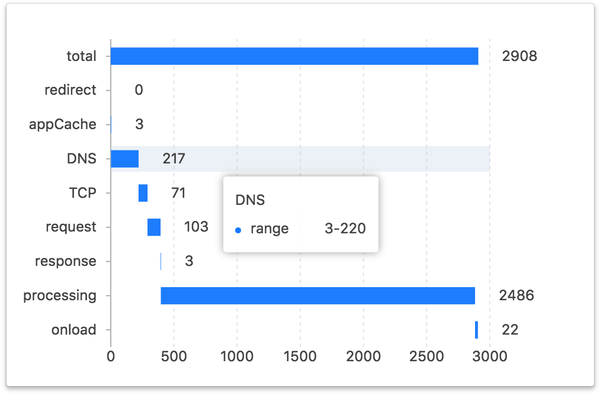
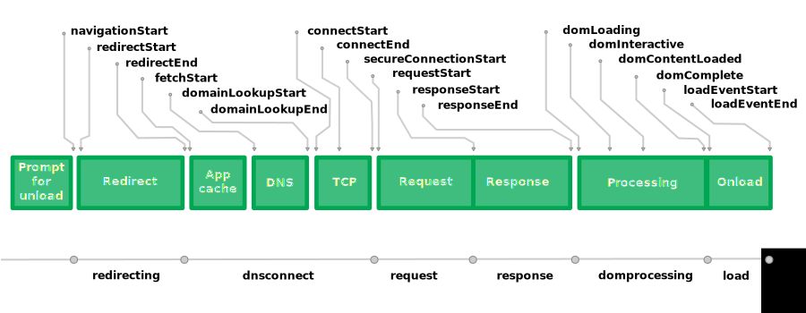

# web-performance-extension

[](https://chrome.google.com/webstore/detail/web-performance/akpccppkhjkefnhhphcejlgobihombma)

## Screenshot



## Performance API Details



## Calc

```javascript
// Time spent during redirection
const redirect = performance.timing.redirectEnd - performance.timing.redirectStart

// AppCache
const appCache = performance.timing.domainLookupStart - performance.timing.fetchStart

// DNS query time
const DNS = performance.timing.domainLookupEnd - performance.timing.domainLookupStart

// TCP connection time
const TCP = performance.timing.connectEnd - performance.timing.connectStart

// Time to first byte
const request = performance.timing.responseStart - performance.timing.requestStart

// Server response time
const response = performance.timing.responseEnd - performance.timing.responseStart

// Dom processing time
const processing = performance.timing.domComplete - performance.timing.responseEnd

// Load event time
const onload = performance.timing.loadEventEnd - performance.timing.loadEventStart
```